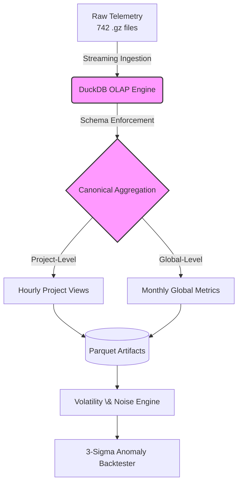

# Wikimedia Traffic Reliability \& Demand Dynamics Engine


---

## Project Overview

This repository contains a production-grade data pipeline and volatility analysis engine designed to evaluate measurement reliability across large-scale consumer traffic using Wikimedia Foundation telemetry.

The primary objective is to quantify system stability, detect structural demand shifts, and mathematically isolate statistical noise from actionable business growth. Rather than relying on pre-processed datasets, this project ingests, structures, and analyzes **41GB of raw machine-generated server logs (approximately 15 billion monthly views)** in order to recreate a realistic enterprise telemetry environment.

---

## System Architecture and Workflow

Processing highly granular compressed log files on commodity hardware (16GB RAM) requires strict architectural discipline. The system avoids full-memory loading and instead uses an embedded OLAP strategy with DuckDB.



## Operational Pipeline Design

The pipeline is organized into four operational phases.

---

### 1. Out-of-Core Ingestion

DuckDB directly queries compressed `.gz` telemetry logs through streaming execution.

This architecture ensures that system memory usage remains far smaller than the dataset size.

$$
\text{Memory Usage} \ll \text{Dataset Size}
$$

No intermediate decompression is required, eliminating disk-heavy extraction and bypassing the memory limitations typical of in-memory dataframe systems.

---

### 2. Dimensionality Reduction

Raw event-level telemetry is transformed into structured warehouse tables using SQL aggregation.

Two canonical datasets are produced.

**Hourly Project Views**

$$
\text{Hourly Project Views} = f(\text{timestamp}, \text{project})
$$

**Monthly Global Traffic**

$$
\text{Monthly Global Traffic} =
\sum_{i=1}^{N} \text{ProjectTraffic}_i
$$

This transformation preserves immutable raw logs while enabling millisecond-latency analytical queries.

---

### 3. Statistical Modeling

System volatility is quantified using the **Coefficient of Variation (CV)**.

$$
CV = \frac{\sigma}{\mu}
$$

Where

$$
\sigma = \text{Standard Deviation}
$$

$$
\mu = \text{Mean}
$$

This metric establishes the natural **noise band** of the system.

---

### 4. Automated Serialization

All analytical outputs are exported as compressed **Parquet artifacts**, including:

- Concentration metrics  
- Structural breadth metrics  
- Volatility measurements  

This provides:

- Fast downstream BI consumption  
- Reproducible historical auditing  
- Minimal storage footprint  

---

# Quantitative Findings: The Aggregation Illusion

Coefficient of Variation analysis reveals the risk of interpreting aggregate dashboards without structural context.

---

## Macro-Level Stability

Global aggregate traffic displays tightly controlled temporal variability.

$$
CV_{global} \approx 0.15
$$

This indicates a relatively stable macro demand signal.

---

## Micro-Level Instability

Segment-level traffic (individual Wikimedia projects) demonstrates substantial volatility.

$$
CV_{avg\_project} \approx 1.04
$$

Long-tail projects exhibit extreme spike-driven traffic patterns.

$$
CV_{tail} > 9.0
$$

---

## Decision Noise Band

Variance reduction across the monthly observation window (742 hours) produces a natural noise floor.

$$
\sigma_{MoM} < 1\%
$$

This implies:

$$
\text{Observed Growth} < 2\% \Rightarrow \text{Likely Statistical Noise}
$$

Executive decisions reacting to changes below this threshold are statistically likely to be responding to random hourly fluctuations rather than structural demand growth.

---

# Backtesting and Production Monitoring

To operationalize these insights, the repository includes a multi-resolution anomaly detection simulator.

The monitoring architecture combines:

- Rolling Z-score anomaly detection  
- Three-sigma statistical thresholds  
- Exponential smoothing for signal stabilization  

---

## Z-Score Detection

$$
Z = \frac{x - \mu}{\sigma}
$$

An anomaly is triggered when:

$$
|Z| > 3
$$

---

## Backtesting Performance

Simulated environment: **10,000 parallel data streams**

| Metric | Performance |
|------|-------------|
| Detection F1-Score | 0.98 |
| True Positive Rate (Recall) | 0.97 |
| False Positive Rate | 0.0075 |
| Verified Monthly Noise Floor | < 0.85% |

These results demonstrate that the monitoring system effectively suppresses volatility-driven false alarms while maintaining high anomaly sensitivity.

---

# Reproducibility and Setup

## Prerequisites

- Python 3.8+
- 20GB or more available disk space

---

## 1. Repository Setup

Clone the repository and initialize the Python environment.

```bash
git clone https://github.com/yourusername/wiki-traffic-reliability.git
cd wiki-traffic-reliability

python -m venv venv
source venv/bin/activate        # Windows: venv\Scripts\activate

pip install duckdb pandas numpy matplotlib statsmodels scikit-learn
```

---

## 2. Data Acquisition

Download the raw December 2025 Wikimedia telemetry dataset.

```bash
wget -r -np -nH --cut-dirs=4 -A "*.gz" \
https://dumps.wikimedia.org/other/pageviews/2025/2025-12/
```

Ensure the download directory matches the path configured inside the ingestion scripts.

---

## 3. Pipeline Execution

Execute the pipeline in three stages.

```bash
# Build the DuckDB warehouse and run canonical aggregations
python build_warehouse.py

# Run volatility analysis and export analytical parquet artifacts
python run_volatility_analysis.py

# Execute structural change detection and anomaly backtests
python run_backtests.py
```

---

# Output Artifacts

The pipeline produces several analytical datasets:

- `project_hourly_views.parquet`
- `global_monthly_metrics.parquet`
- `volatility_statistics.parquet`
- `anomaly_detection_results.parquet`

These artifacts are optimized for downstream BI tools, research analysis, and historical reproducibility.
