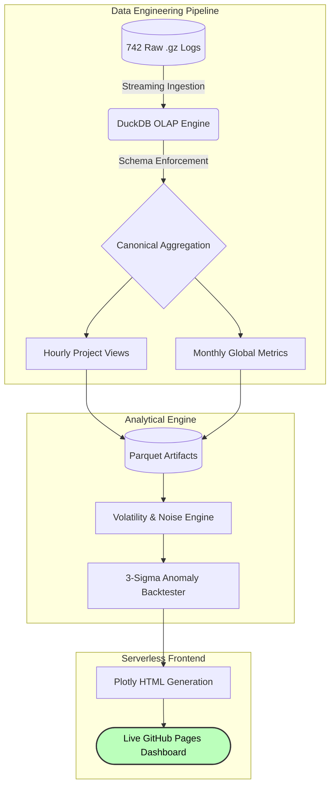

# Wikimedia Traffic Reliability & Demand Dynamics Engine

[](https://ad1007.github.io/Reliabillity-Demand-Dynamics-analysis/)


---

## Project Overview

This repository contains a production-grade data pipeline and volatility analysis engine designed to evaluate measurement reliability across large-scale consumer traffic using Wikimedia Foundation telemetry.

The primary objective is to quantify system stability, detect structural demand shifts, and mathematically isolate statistical noise from actionable business growth. Rather than relying on pre-processed datasets, this system ingests, structures, and analyzes **41GB** of raw machine-generated server logs (approximately **15 billion** monthly views) to recreate a realistic enterprise telemetry environment.

---

## System Architecture & Workflow

Processing highly granular compressed log files on commodity hardware (**16GB RAM**) requires strict architectural discipline. The system bypasses full-memory loading, utilizing an embedded OLAP strategy via DuckDB, and concludes with a serverless interactive frontend.



---

## 1. Operational Pipeline Design

### 1.1 Out-of-Core Ingestion
DuckDB directly queries compressed `.gz` telemetry logs through streaming execution. This architecture ensures that system memory usage remains fractionally small compared to the dataset size. No intermediate decompression is required, eliminating disk-heavy extraction and bypassing the memory limitations typical of standard in-memory dataframe operations.

### 1.2 Dimensionality Reduction
Raw event-level telemetry is transformed into structured warehouse tables using SQL aggregation, producing two canonical datasets:
* **Hourly Project Views:** Granular tracking of distinct Wikimedia projects.
* **Monthly Global Traffic:** Aggregate system-wide demand.

### 1.3 Automated Serialization
All analytical outputs are exported as highly compressed **Parquet artifacts**. This guarantees fast downstream BI consumption, minimal storage footprint, and reproducible historical auditing.

### 1.4 Serverless Dashboard Deployment
Instead of deploying a resource-heavy web framework, the presentation layer is engineered for maximum efficiency. Python's `plotly.express` consumes the Parquet files to generate a standalone HTML dashboard, deployed permanently via **GitHub Pages**, resulting in a zero-backend, zero-latency KPI tracker.

---

## 2. Quantitative Findings: The Aggregation Illusion

System volatility is quantified using the **Coefficient of Variation (CV)** to establish the natural noise band of the system:

$$CV = \frac{\sigma}{\mu}$$

Our analysis reveals the severe risk of interpreting aggregate dashboards without structural context:
* **Macro-Level Stability:** Global aggregate traffic displays tightly controlled temporal variability ($CV \approx 0.15$).
* **Micro-Level Instability:** Segment-level traffic demonstrates substantial volatility ($CV \approx 1.04$). Long-tail projects exhibit extreme, spike-driven traffic patterns ($CV > 9.0$).

**The Decision Noise Band:**
Variance reduction across the monthly observation window (**742 hours**) produces a natural noise floor of **< 1%**. Therefore, executive decisions reacting to month-over-month changes below **2%** are statistically likely to be responding to random hourly fluctuations, not true structural demand growth.

---

## 3. Backtesting and Production Monitoring

To operationalize these insights, the repository includes a multi-resolution anomaly detection simulator combining rolling Z-score detection, three-sigma statistical thresholds, and exponential smoothing.

$$Z = \frac{x - \mu}{\sigma}$$

An anomaly is dynamically triggered when $|Z| > 3$.

**Simulated Environment Performance (10,000 parallel data streams):**

| Metric | Performance |
| :--- | :--- |
| **Detection F1-Score** | 0.98 |
| **True Positive Rate (Recall)** | 0.97 |
| **False Positive Rate** | 0.0075 |
| **Verified Monthly Noise Floor** | < 0.85% |

These results demonstrate that the monitoring system effectively suppresses volatility-driven false alarms while maintaining high anomaly sensitivity.

---

## 4. Reproducibility and Setup

### Prerequisites
* Python 3.8+
* **20GB+** available disk space

### Repository Setup

```bash
git clone [https://github.com/ad1007/Reliabillity-Demand-Dynamics-analysis.git](https://github.com/ad1007/Reliabillity-Demand-Dynamics-analysis.git)
cd Reliabillity-Demand-Dynamics-analysis

python -m venv venv
source venv/bin/activate        # Windows: venv\Scripts\activate

pip install duckdb pandas numpy matplotlib statsmodels scikit-learn plotly
```

### Data Acquisition
Download the raw December 2025 Wikimedia telemetry dataset:

```bash
wget -r -np -nH --cut-dirs=4 -A "*.gz" \
[https://dumps.wikimedia.org/other/pageviews/2025/2025-12/](https://dumps.wikimedia.org/other/pageviews/2025/2025-12/)
```

### Pipeline Execution
*Note: The primary execution engine is currently unified within the master Jupyter Notebook (`.ipynb`). Execute the notebook sequentially to build the warehouse, generate the Parquet artifacts, and compile the HTML dashboard.*

---

## 5. Output Artifacts

Running the pipeline successfully produces the following analytical datasets, optimized for downstream BI tools and research analysis:

* `project_hourly_views.parquet`
* `global_monthly_metrics.parquet`
* `volatility_statistics.parquet`
* `anomaly_detection_results.parquet`
* `index.html` *(Live Plotly Dashboard)*
